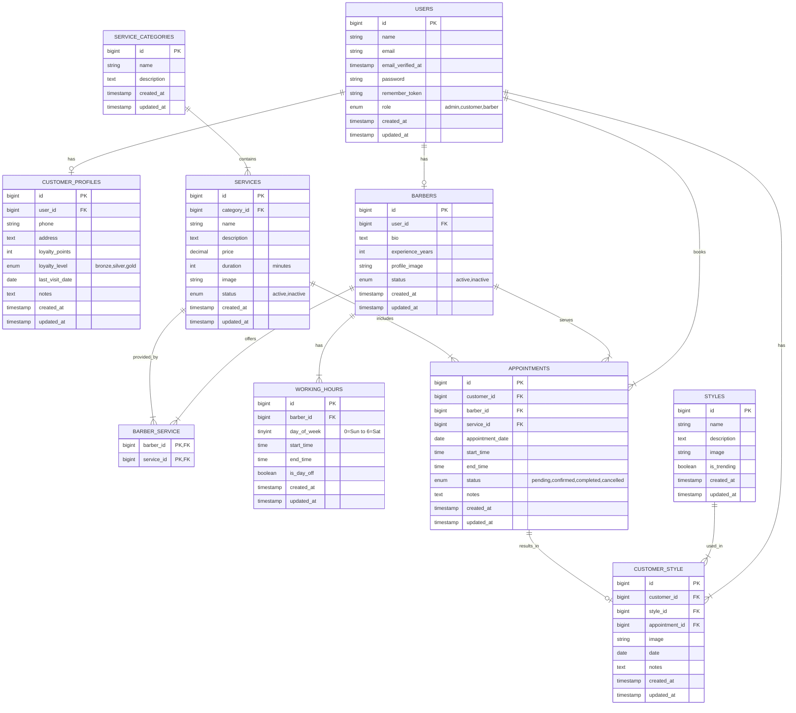

# Barbershop Database Entity-Relationship Diagram

## Relationship Legend
- `||--o|`: One-to-zero-or-one relationship
- `||--|{`: One-to-many relationship
- `}|--|{`: Many-to-many relationship

## Key
- PK: Primary Key
- FK: Foreign Key

